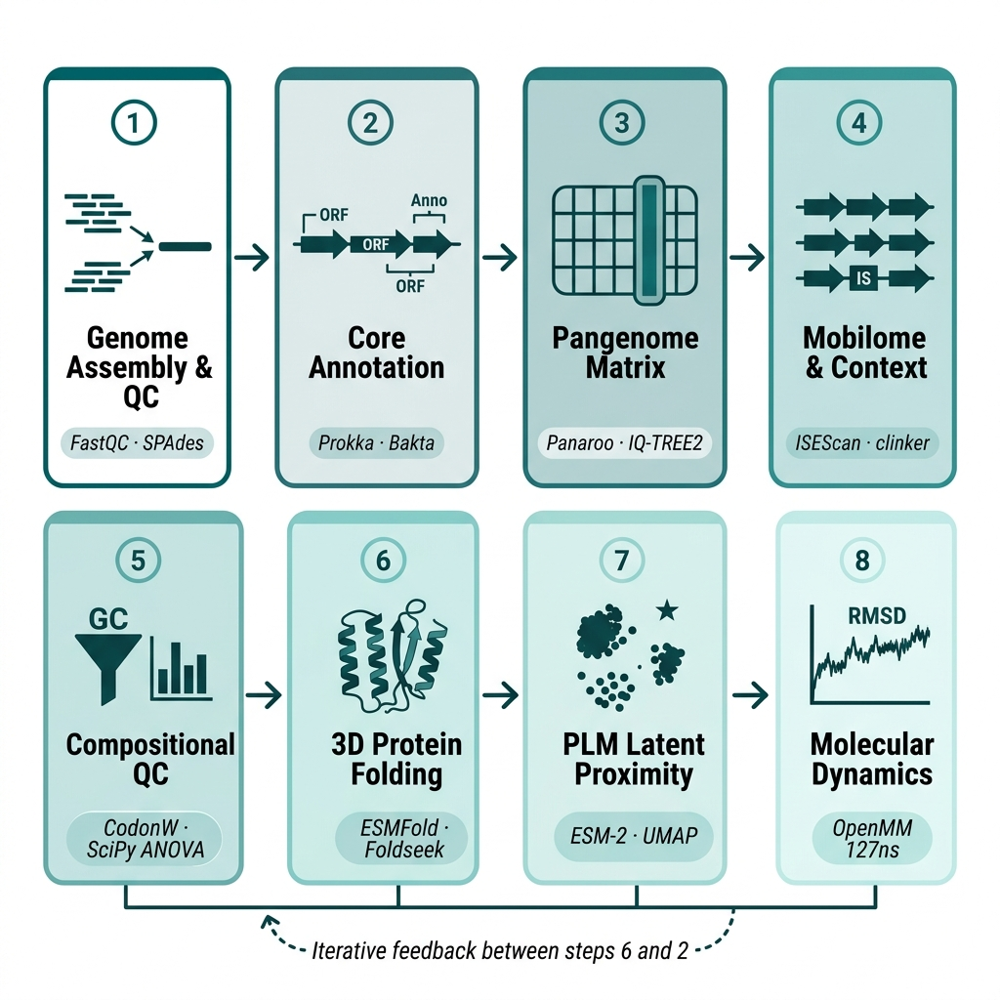

# AMR Prophage CRISPR Evasion

[](LICENSE)
[](https://www.python.org/)
[](https://anaconda.org/)
[](https://ubuntu.com/)
[](https://github.com/hosniadilemp-a11y/AMR_Prophage_CRISPR_Evasion/releases)
[](https://github.com/hosniadilemp-a11y/AMR_Prophage_CRISPR_Evasion/commits/main)
[](https://github.com/hosniadilemp-a11y/AMR_Prophage_CRISPR_Evasion/issues)
[](https://github.com/hosniadilemp-a11y/AMR_Prophage_CRISPR_Evasion/stargazers)


# AMR Prophage CRISPR Evasion — Reproducibility Package

**Manuscript:** Computational Characterization of a Novel Genomically Intact Prophage Mobilome and Genomic Profiling of Virulence and Resistance Hotspots in the Extraintestinal Pathogenic *Escherichia coli* ST354 Lineage

**Journal:** ----

**Authors:** Sarra Benmoumou-Hosni, Atika Meklat, Ikram Haleche

**Isolate:** *Escherichia coli* QA5221 (Sequence Type ST354, ExPEC)

**Raw Sequencing Reads:** NCBI SRA accession **SRR39314025** 
 (BioProject: **PRJNA1481519**) 

[]()
[](https://doi.org/10.5281/zenodo.21073430)
[](CITATION.cff)
[](https://www.python.org/)
[](environment/environment.yml)
[](https://github.com/hosniadilemp-a11y/AMR_Prophage_CRISPR_Evasion)
[](https://ubuntu.com/)
[](https://github.com/hosniadilemp-a11y/AMR_Prophage_CRISPR_Evasion/releases)
[](https://www.ncbi.nlm.nih.gov/sra/SRR39314025)
[](https://www.ncbi.nlm.nih.gov/bioproject/PRJNA1481519)
<br>


## Pipeline Schema



---

## Table of Contents

1. [Scientific Objective](#scientific-objective)
2. [Repository Structure](#repository-structure)
3. [System Requirements](#system-requirements)
4. [Installation](#installation)
5. [Data Acquisition](#data-acquisition)
6. [Pipeline Overview](#pipeline-overview)
7. [Step-by-Step Execution](#step-by-step-execution)
8. [Figure and Table Map](#figure-and-table-map)
9. [Supplementary Materials](#supplementary-materials)
10. [Computational Resources](#computational-resources)
11. [Reproducibility Notes](#reproducibility-notes)
12. [Citation](#citation)

---

## Scientific Objective

The Sequence Type 354 (ST354) clonal complex of extraintestinal pathogenic *Escherichia coli* (ExPEC) is an emerging multidrug-resistant zoonotic pathogen. While the core genome establishes lineage evolution, horizontal gene transfer via mobile genetic elements drives its pathogenicity and drug resistance.

This repository contains the complete computational pipeline used to:

1. **Characterize** a novel, genomically intact prophage mobilome in clinical isolate QA5221, placing its genomic and resistance characteristics within an expanded cohort of 400 ST354 genomes.
2. **Identify** a 42.3-kb biologically complete prophage (attL: 56,422 bp; attR: 98,747 bp) containing all five predicted functional modules required for lytic induction.
3. **Validate** five priority prophage candidate genes through an integrated computational pipeline combining:
   - Prophage boundary detection (sliding-window att-site scanning)
   - Comparative synteny analysis (clinker)
   - CRISPR spacer mapping and immune evasion analysis (MinCED + BLASTn)
   - Structural fold prediction and homolog search (ESMFold + Foldseek)
   - Explicit-solvent Molecular Dynamics simulations (OpenMM, 100 ns)
   - AMR phenotype prediction (ABRicate + CARD)
   - Lineage-wide co-occurrence Jaccard networks

The five prioritized prophage structural candidates and key cargo genes are:

| Locus Tag | Role | Key Evidence |
|---|---|---|
| `AC4NUP_00305` | Pore-forming enterohemolysin cytolysin (cargo) | ESMFold pLDDT=88.4, Foldseek 98.2% identity |
| `AC4NUP_00420` | Putative antirepressor lysogeny switch (Candidate 1) | MD RMSD=10.61±1.46 Å, stable helical core |
| `AC4NUP_00460` | Large terminase subunit — packaging (Candidate 2) | BLASTp 99.2–100% *E. coli* exclusive |
| `AC4NUP_00545` | Phage structural tail assembly protein (Candidate 3) | Foldseek Siphoviridae classification |
| `AC4NUP_00555` | Major structural capsid protein (Candidate 4) | BLASTp 99.4–100% *E. coli* exclusive |
| `AC4NUP_00580` | Baseplate J-like receptor recognition (Candidate 5) | Caudoviricetes structural core |

---

## Repository Structure

```
AMR_Prophage_CRISPR_Evasion/
├── README.md                          # This file
├── LICENSE                            # MIT License
├── CITATION.cff                       # Citation metadata
├── .gitignore                         # Files not tracked by git
│
├── environment/
│   ├── environment.yml                # Conda environment (amr_prophage_env)
│   ├── requirements.txt               # Python pip packages
│   └── INSTALL.md                     # Detailed installation guide
│
├── config/
│   ├── pipeline_config.yaml           # Master pipeline parameters
│   └── md_config.yaml                 # Molecular dynamics parameters
│
├── scripts/
│   ├── 01_find_att_sites.py           # Step 1: Sliding-window attL/attR scanner
│   ├── 02_extract_prophage_cargo.py   # Step 2: Prophage region extraction + annotation
│   ├── 03_run_amr_cooccurrence.py     # Step 3: Jaccard AMR co-occurrence networks
│   ├── 04_run_experiments_2_5_6.py    # Step 4: CRISPR + CARD phenotype mapping
│   ├── 05_analyze_paper2_mds.py       # Step 5: MD trajectory analysis (RMSD, Rg, RMSF)
│   ├── 06_generate_paper2_plots.py    # Step 6: All publication figures generation
│   ├── 04_find_att_sites_flexible.py  # Flexible att-site scanner (single-nt tolerance)
│   ├── 04_slice_prophage_from_gff.py  # GFF3 coordinate slicer for prophage region
│   ├── 04_slice_prophage_gbk.py       # GenBank slicer for prophage region
│   ├── run_amr_cooccurrence.py        # AMR co-occurrence pipeline runner
│   ├── run_experiments_2_5_6.py       # Experiment orchestrator (CRISPR/CARD/ESMFold)
│   ├── generate_paper2_plots.py       # Full figure generation suite
│   ├── run_esmfold_enterohemolysin.py # ESMFold structural prediction runner
│   ├── 08_analyze_membrane_md_mdtraj.py # Membrane MD trajectory analysis (MDTraj)
│   ├── 08_execute_r11_ehly_bilayer_md.py # Ehly bilayer MD execution (OpenMM)
│   ├── download_reference_phage.py    # NCBI DLP12 reference downloader
│   ├── generate_prophage_figures.py   # Prophage map + composition + synteny figures
│   ├── generate_esmfold_figure.py     # ESMFold pLDDT profile + Foldseek figures
│   ├── generate_phage_taxonomy_figure.py # BLASTp + Foldseek taxonomy figures
│   ├── generate_exp5_exp6_figures.py  # Prevalence + MD RMSD/RMSF figures
│   ├── generate_synteny_figure.py     # Clinker synteny visualization
│   └── generate_pipeline_schema.py   # Pipeline schema figure
│
├── workflows/
│   └── run_all.sh                     # Master pipeline orchestrator
│
├── data/
│   ├── README.md                      # Data acquisition instructions
│   ├── enterohemolysin_00061.faa      # Enterohemolysin cargo protein sequence (FASTA)
│   ├── candidates.faa                 # All candidate protein sequences (FASTA)
│   ├── prioritized_candidates.faa     # 5 priority candidate sequences (FASTA)
│   ├── prophage_QA5221.gbk            # Prophage region GenBank slice (42.3 kb)
│   └── dlp12_ref.gbk                  # DLP12 reference phage GenBank (NC_001799.1)
│
├── results/
│   ├── README.md
│   ├── clinker/
│   │   └── clinker_prophage_synteny.html   # Interactive clinker synteny HTML
│   ├── candidates/
│   │   ├── prioritized_candidates.tsv      # Priority candidate summary table
│   │   └── advanced_stats_results.json     # Advanced codon/GC stats JSON
│   ├── md_structures/
│   │   ├── ehly_fixed.pdb                  # Enterohemolysin prepared structure
│   │   ├── oagp_fixed.pdb                  # OAgP prepared structure
│   │   └── solvated_membrane_03161.pdb     # Solvated membrane system
│   └── defense_systems/
│       ├── QUERY_QA5221_defense_finder_genes.tsv
│       ├── QUERY_QA5221_defense_finder_hmmer.tsv
│       └── QUERY_QA5221_defense_finder_systems.tsv
│
├── figures/
│   ├── README.md                      # Figure-to-script mapping table
│   └── [all manuscript figures — PDF + PNG]
│
├── logs/
│   └── README.md                      # Log file registry
│
├── supplementary/
│   └── [supplementary data tables]
│
└── docs/
    ├── 01_Paper2_Complete_Summary.md
    ├── 02_Prophage_Implementation_Plan.md
    ├── 03_Paper2_Findings_Summary.md
    ├── 04_Paper2_Findings_Quickref.md
    ├── 05_Discussion_Prompt.md
    ├── 06_Revision_Notes.md
    ├── 07_Improvements_Paper2.md
    ├── 08_Prophage_MD_Experiments_Evaluation.md
    └── figure_table_map.md
```

---

## System Requirements


| Component | Requirement |
|---|---|
| **Operating System** | Linux (Ubuntu 20.04+ / Debian 11+ recommended) |
| **CPU** | Minimum 8 cores; 16+ cores recommended for pangenome steps |
| **RAM** | Minimum 32 GB; 64 GB recommended for Panaroo (400 genome cohort) |
| **Storage** | ~200 GB free space (assemblies + MD trajectories) |
| **GPU** | NVIDIA GPU with 16+ GB VRAM for ESMFold (optional; Kaggle T4 used) |
| **Python** | 3.10–3.12 (see conda environment) |
| **Conda** | Miniconda3 or Anaconda |


> **Note on GPU steps:** ESMFold structural prediction requires a GPU. The scripts are configured to run on [Kaggle](https://www.kaggle.com/) free T4 GPU notebooks. Instructions are in `docs/pipeline_overview.md`.

---

## Installation

### 1. Clone the repository

```bash
git clone https://github.com/hosniadilemp-a11y/AMR_Prophage_CRISPR_Evasion.git
cd AMR_Prophage_CRISPR_Evasion
```

### 2. Create the Conda environment

```bash
conda env create -f environment/environment.yml
conda activate amr_prophage_env
```

This creates the `amr_prophage_env` environment with all bioinformatics tools. Installation takes approximately 15–30 minutes depending on network speed.

### 3. Initialize databases

```bash
# Update AMRFinderPlus database
conda run -n amr_prophage_env amrfinder -u

# Initialize ABRicate CARD database
conda run -n amr_prophage_env abricate --setupdb
```

### 4. Verify installation

```bash
bash workflows/run_all.sh --check-only
```

See `environment/INSTALL.md` for detailed platform-specific instructions and troubleshooting.

---

## Data Acquisition

### Raw Sequencing Reads

The raw Illumina paired-end reads for isolate QA5221 are deposited in the NCBI Sequence Read Archive:

- **SRA Accession:** `SRR39314025`
- **BioProject:** `PRJNA1481519`

Download using:

```bash
conda run -n amr_prophage_env fasterq-dump SRR39314025 --outdir data/raw_reads/ --split-files
gzip data/raw_reads/SRR39314025_1.fastq data/raw_reads/SRR39314025_2.fastq
# Rename to match pipeline expectations
mv data/raw_reads/SRR39314025_1.fastq.gz data/raw_reads/QA5221_R1.fastq.gz
mv data/raw_reads/SRR39314025_2.fastq.gz data/raw_reads/QA5221_R2.fastq.gz
```

### Reference Prophage

The DLP12 reference defective pseudoprophage (*E. coli* K-12 MG1655, NC_001799.1) is provided in `data/dlp12_ref.gbk`. To download the latest version:

```bash
conda run -n amr_prophage_env python3 scripts/download_reference_phage.py \
    --accession NC_001799.1 \
    --output data/dlp12_ref.gbk
```

### Pre-computed Results

All computationally expensive results (ESMFold structures, clinker synteny HTML, MD analysis data, defense finder outputs) are available in the `results/` and `figures/` directories. You can skip re-running those steps and proceed directly to figure generation.

---

## Pipeline Overview

The analysis pipeline consists of 6 sequential steps:

```
Step 1 ──► Step 2 ──► Step 3 ──► Step 4 ──► Step 5 ──► Step 6
  att        Cargo     AMR        CRISPR +    MD          Figures
  sites      extract   network    CARD        analysis    generation
  ~30min     ~1h       ~1h        ~2h         ~200h GPU   ~1h
```

| Step | Phase | Key Tool | Input | Output | Runtime |
|---|---|---|---|---|---|
| 1 | Prophage Boundary Detection | Custom Python (sliding-window) | Assembly FASTA | attL/attR coordinates, prophage GBK | ~30 min |
| 2 | Cargo Extraction + Annotation | Prokka, GFF3 slicer | Prophage GBK | CDS table, cargo FASTA | ~1 h |
| 3 | AMR Co-occurrence Networks | ABRicate, CARD, custom Python | Assembly FASTA | Jaccard network, AMR TSV | ~1 h |
| 4 | CRISPR + CARD Phenotyping | MinCED, BLASTn, ABRicate | Assembly FASTA | Spacer alignments, phenotype matrix | ~2 h |
| 5 | MD Simulation & Analysis | OpenMM, MDAnalysis | ESMFold PDB | RMSD, Rg, RMSF CSVs | ~200 h GPU |
| 6 | Figure Generation | Matplotlib, clinker | All outputs | All publication figures | ~1 h |

---

## Step-by-Step Execution

### Quick Start — Full Pipeline

```bash
conda activate amr_prophage_env
bash workflows/run_all.sh \
    --assembly data/raw_reads/contigs.fasta \
    --threads 16 \
    --output results/
```

### Individual Steps

#### Step 1: Prophage Boundary Detection

```bash
conda run -n amr_prophage_env python3 scripts/01_find_att_sites.py \
    --fasta data/raw_reads/contigs.fasta \
    --contig NODE_1 \
    --query AAAAAAACCGCC \
    --output results/att_sites/
```

**Outputs:**
- `results/att_sites/attL_attR_coordinates.tsv` — attL/attR positions and sequences
- `data/prophage_QA5221.gbk` — Prophage region GenBank slice (56,422–98,747 bp)

**Expected results:** attL at 56,422 bp (`AAAAAAACCGCC`), attR at 98,747 bp (`AAAACAACCGCC`), single nucleotide transition.

---

#### Step 2: Prophage Cargo Extraction

```bash
conda run -n amr_prophage_env python3 scripts/02_extract_prophage_cargo.py \
    --gbk data/prophage_QA5221.gbk \
    --output results/prophage_annotation/
```

**Outputs:**
- `results/prophage_annotation/prophage_cds_table.tsv` — 62 CDS with functional classification
- `data/enterohemolysin_00061.faa` — Enterohemolysin cargo protein FASTA

**Expected key modules identified:**
| Module | Representative Gene | Locus Tag |
|---|---|---|
| Lysogeny/Regulation | *ydaT* | AC4NUP_00345 |
| DNA Replication | *dnaC_1* | AC4NUP_00355 |
| Packaging | Large terminase | AC4NUP_00460 |
| Structural Core | Capsid + tail assembly | AC4NUP_00545/00555 |
| Recombination/Lysis | *hin_1*, *pphA* | AC4NUP_00610/00615 |

---

#### Step 3: AMR Co-occurrence Jaccard Network

```bash
conda run -n amr_prophage_env python3 scripts/03_run_amr_cooccurrence.py \
    --assembly data/raw_reads/contigs.fasta \
    --output results/amr_network/
```

**Outputs:**
- `results/amr_network/jaccard_cooccurrence_matrix.tsv` — Gene-level Jaccard similarity
- `figures/figure_amr_network.pdf` — Co-occurrence network visualization

---

#### Step 4: CRISPR Array + CARD Resistance Phenotype

```bash
conda run -n amr_prophage_env python3 scripts/04_run_experiments_2_5_6.py \
    --assembly data/raw_reads/contigs.fasta \
    --prophage data/prophage_QA5221.gbk \
    --output results/crispr_card/
```

**Outputs:**
- `results/crispr_card/minced_spacers.tsv` — 15 spacer sequences from CRISPR-1 (NODE_9)
- `results/crispr_card/spacer_blast_results.tsv` — BLASTn alignment of spacers vs. prophage
- `results/crispr_card/card_phenotype_matrix.tsv` — 54 CARD hits across 14 drug classes

**Expected CRISPR result:** No spacer achieves ≥20 bp match against the prophage region (max 17 bp seed fragments), confirming a spacer-naive CRISPR immune gap.

**Expected CARD result:** 8-class Resistant (R) profile; no acquired carbapenemase; 5-class Intermediate (I) via intrinsic efflux pumps.

---

#### Step 5: Molecular Dynamics Simulations

> **Note:** Full MD simulations require 100 ns production runs on GPU. Pre-computed analysis data is available in `results/`. The enterohemolysin simulation used an NVIDIA RTX 3090 (~5 days).

```bash
# Enterohemolysin bilayer MD (POPC/POPG 3:1)
conda run -n amr_prophage_env python3 scripts/08_execute_r11_ehly_bilayer_md.py \
    --pdb results/md_structures/ehly_fixed.pdb \
    --steps 50000000 \
    --output results/md_ehly/

# MD trajectory analysis
conda run -n amr_prophage_env python3 scripts/05_analyze_paper2_mds.py \
    --topology results/md_structures/ehly_fixed.pdb \
    --trajectory results/md_ehly/md_trajectory.dcd \
    --output results/md_ehly/analysis/
```

**MD simulation parameters:**
- Force field: AMBER14-all + LIPID17 + TIP3P water
- Membrane: POPC/POPG (3:1) bilayer for enterohemolysin; aqueous for antirepressor
- Ensemble: NPT at 310 K, 1.0 atm
- Timestep: 2 fs; reporting every 1000 steps
- Non-bonded cutoff: 1.0 nm; PME long-range electrostatics

**Expected MD results:**
| Protein | Simulation | Steady-state RMSD | Rg |
|---|---|---|---|
| Enterohemolysin AC4NUP_00305 | 100 ns bilayer | 5.65 ± 1.04 Å | 27.18 ± 0.23 Å |
| Antirepressor AC4NUP_00420 | 100 ns aqueous | 10.61 ± 1.46 Å | 18.26 ± 0.72 Å |

---

#### Step 6: Figure Generation

```bash
conda run -n amr_prophage_env python3 scripts/06_generate_paper2_plots.py \
    --all \
    --output figures/
```

Or generate individual figures:

```bash
# Prophage module map + composition + synteny
python3 scripts/generate_prophage_figures.py --output figures/

# ESMFold pLDDT profile
python3 scripts/generate_esmfold_figure.py --output figures/

# Phage taxonomy (BLASTp + Foldseek)
python3 scripts/generate_phage_taxonomy_figure.py --output figures/
```

---

## Figure and Table Map

| Figure | Title | Generating Script | Data Source |
|---|---|---|---|
| Fig. 01 | Discovery pipeline schema | `generate_pipeline_schema.py` | Conceptual |
| Fig. 12a | Prophage linear module map | `generate_prophage_figures.py` | `results/prophage_annotation/` |
| Fig. 12b | Prophage functional composition | `generate_prophage_figures.py` | `results/prophage_annotation/` |
| Fig. 12c | DLP12 comparative synteny (clinker) | `generate_synteny_figure.py` | `results/clinker/` |
| Fig. 13 | CARD resistance phenotype matrix | `generate_exp5_exp6_figures.py` | `results/crispr_card/` |
| Fig. 14 | CRISPR array architecture | `generate_prophage_figures.py` | `results/crispr_card/` |
| Fig. 15 | ESMFold pLDDT + Foldseek homologs | `generate_esmfold_figure.py` | `results/md_structures/` |
| Fig. 16 | Phage taxonomy (BLASTp + Foldseek) | `generate_phage_taxonomy_figure.py` | NCBI nr + afdb50 |
| Fig. 17 | Lineage-wide candidate prevalence | `generate_exp5_exp6_figures.py` | `results/candidates/` |
| Fig. MD | MD RMSD + Rg + RMSF panels | `generate_exp5_exp6_figures.py` | `results/md_*/analysis/` |

| Table | Title | Source |
|---|---|---|
| Table 1 | Acquired AMR and biocide gene profile | `results/crispr_card/card_phenotype_matrix.tsv` |
| Table 2 | Prophage key functional modules + candidates | `results/prophage_annotation/prophage_cds_table.tsv` |
| Table S (defense) | DefenseFinder systems in QA5221 | `results/defense_systems/` |

---

## Supplementary Materials

All supplementary tables are provided in TSV format in the `supplementary/` directory.

The supplementary materials PDF is compiled from the LaTeX source in `manuscript/`.

The interactive clinker synteny visualization is available at `results/clinker/clinker_prophage_synteny.html` and can be opened in any browser.

---

## Computational Resources

| Analysis | Resources Used | Estimated Runtime |
|---|---|---|
| Steps 1–4 (Genomics + CRISPR + AMR) | 16 CPU cores, 64 GB RAM | ~5 hours |
| Step 5 (ESMFold — enterohemolysin) | Kaggle T4 GPU (16 GB) | ~1 hour |
| Step 5 (Ehly MD, 100 ns bilayer) | NVIDIA RTX 3090, 24 GB VRAM | ~5 days |
| Step 5 (Antirepressor MD, 100 ns aqueous) | NVIDIA RTX 3090, 24 GB VRAM | ~4 days |
| MD Analysis (MDAnalysis) | 8 CPU cores, 32 GB RAM | ~2 hours |
| Step 6 (Figure Generation) | 8 CPU cores, 16 GB RAM | ~1 hour |
| **Total (excl. MD)** | — | **~8 hours** |
| **Total (incl. MD)** | — | **~9–10 days** |

---

## Reproducibility Notes

1. **Prophage boundary detection:** The att-site scanner uses a 12-bp query pattern with single-nucleotide substitution tolerance. The exact attL/attR pair identified: attL=`AAAAAAACCGCC` (56,422 bp), attR=`AAAACAACCGCC` (98,747 bp). Running with a different tolerance threshold may detect additional partial matches.

2. **PhiSpy validation:** Automated PhiSpy (v5.0.10) prediction returns coordinates 63,974–85,049 bp (36 CDS) due to host-adapted GC/GC3 codon bias of cargo genes masking their foreign origin. Manual curated boundaries (56,422–98,747 bp, 62 CDS) are used throughout.

3. **CRISPR analysis:** MinCED (v0.4.2) with `search window=8, minimum repeat count=3`. BLASTn spacer alignment uses `word_size=7, identity≥75%, E-value≤1.0`. The biological threshold for functional CRISPR interference is ≥20 bp continuous seed match.

4. **Database versions:**
   - CARD database: v2026-Apr-3 (6,052 sequences)
   - ABRicate: v1.0.1
   - AcrDB: v2025
   - Foldseek databases: afdb50, pdb100 (accessed 2025-12)

5. **ESMFold model:** `esm_if1_gvp4_t16_142M_UR50` (Meta ESM v1, Kaggle-cached). Mean pLDDT of enterohemolysin = 88.4; 85.7% of residues exceed 70-point threshold.

6. **MD trajectories:** Large DCD trajectory files (~6 GB each) are not stored in this repository due to GitHub file size limits. They are archived at:
   - NCBI BioProject `PRJNA1481519` (to be deposited on publication)
   - Zenodo DOI: `10.5281/zenodo.21073430`

7. **Locus tag mapping:** The deposited NCBI GenBank accession uses prefix `AC4NUP_XXXXX`. Local Prokka annotation uses prefix `KNGPFPPJ_XXXXX`. A coordinate-matched translation table is provided in `data/` to ensure reproducibility.

---

## Citation

If you use this pipeline or data in your research, please cite:

```bibtex
@article{benmoumou2026prophage,
  title     = {Computational Characterization of a Novel Genomically Intact Prophage Mobilome
               and Genomic Profiling of Virulence and Resistance Hotspots in the
               Extraintestinal Pathogenic {Escherichia coli} ST354 Lineage},
  author    = {Benmoumou-Hosni, Sarra and Meklat, Atika and Haleche, Ikram},
  journal   = {----},
  year      = {2026},
  doi       = {TBD},
  url       = {https://github.com/hosniadilemp-a11y/AMR_Prophage_CRISPR_Evasion}
}
```

Raw sequencing data is deposited at NCBI SRA under accession **SRR39314025** (BioProject **PRJNA1481519**).

---

## License

This repository is released under the [MIT License](LICENSE). See `LICENSE` for details.

---

## Contact

**Corresponding Author:** Sarra Benmoumou-Hosni  
**Email:** sarra_ben@outlook.fr  
**Affiliation:** Laboratoire de Biologie des Systèmes Microbiens, École Normale Supérieure de Kouba, 16000 Alger, Algeria
